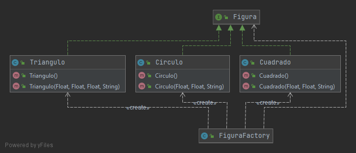

# Aplicación de Test Remoto
<details>
<summary>Introducción</summary>
<br>
         Desarrollar una clase que permita la creación de objetos que representen figuras geométricas
</details>

<details>

<summary>Documentación</summary>
         UML:




</details>

<details>

<summary>Instalacion Backend</summary>
         Proyecto montado con Spring Boot y Java 8, con los siguientes frameworks / libraries / funcionalidades:

 - Spring Boot: versión 2. posibilidad de arrancar directamente con el plugin de maven o generar un war para despliegue en 
 tomcat o similar. Con 'actuator' activado.

 - Servicio completo RESTful con Spring 

 - Capa de base de datos con Spring DATA Postgres
</details>

<details>

<summary>Instalacion Frontend </summary>
         Proyecto montado en fronend

 - Node 

 - Angula

 </details>

<details>
<summary>Instalación local</summary>
 - Arrancar directamente con el plugin de SpringBoot:
 
    ```
    mvn spring-boot:run
    ```

  - Arrancar Angula:
 
    ```
    npm install
    npm start
    ```
</details>

<details>
<summary>Sistema Online</summary>
 - Servidor Heroku:
 
    https://test-tecnico.herokuapp.com/tutorials
 
</details>


